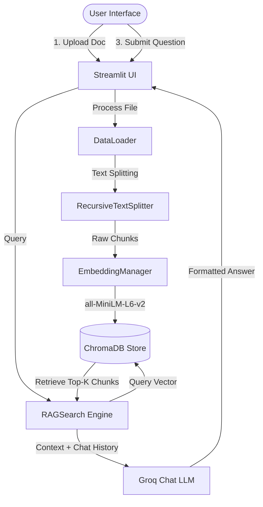

# 🤖 Document RAG Assistant

**Live Deployment URL:** 🚀 [https://document-rag-assistant-7asim.streamlit.app/](https://document-rag-assistant-7asim.streamlit.app/)

A high-performance, developer-friendly **Retrieval-Augmented Generation (RAG)** application. Load documents dynamically, query them with scoped context, inspect exact similarity scores, and review sources through an interactive, dashboard-style web interface.

Developed with a modular Python backend (ChromaDB + SentenceTransformers + Groq LLMs) and a highly polished Streamlit frontend.

---

## ✨ Key Features

- **📂 Multi-Format Document Ingestion**: Process `PDF`, `DOCX`, `TXT`, `CSV`, and `Excel` files on the fly.
- **⚡ Ultra-Low Latency LLM**: Powered by Groq Cloud API featuring advanced inference models (default: `openai/gpt-oss-120b`).
- **🔍 Granular Search Scope**: Ask questions across all indexed files globally, or limit searches to a single selected document using the scope toggle.
- **📚 Source Citations & Previews**: Answers are marked with explicit citations. Click to expand and inspect the exact text block retrieved.
- **⚙️ Dynamic RAG Tuning**: Fine-tune parameters like chunk size, chunk overlap, and retriever count ($K$) in real-time from the interface.
- **🧬 Audit-Ready Retrieval Trace**: A diagnostic dashboard showing exact retrieved chunks and their mathematical similarity scores (Cosine Distance).
- **⏱️ Engine Metrics**: Live tracking of tokenization chunk counts, turn counts, and processing latencies.
- **💬 Conversational Memory**: Supports multi-turn dialogue, carrying context gracefully from one follow-up query to the next.

---

## 🛠️ Tech Stack & Architecture



- **Frontend**: Streamlit (custom dark-theme layout, custom CSS, real-time metrics cards)
- **Vector DB**: ChromaDB (persistent filesystem storage)
- **Embeddings**: SentenceTransformers (`all-MiniLM-L6-v2` generating 384-dimensional dense vectors)
- **LLM Provider**: Groq Cloud API
- **Parsers**: `PyPDFLoader`, `Docx2txtLoader`, `UnstructuredExcelLoader`, `TextLoader`

---

## 📁 Project Directory Structure

```text
├── src/
│   └── yt_rag/
│       ├── .streamlit/
│       │   └── config.toml          # Custom Streamlit layout & settings
│       ├── data/
│       │   ├── pdf/                 # Directory for PDFs
│       │   └── text_files/          # Directory for Text files
│       ├── src/
│       │   ├── __init__.py
│       │   ├── data_loader.py       # Multi-format document loading logic
│       │   ├── embedding.py         # Embedding manager (singleton pattern)
│       │   ├── search.py            # RAG context formulation & LLM call
│       │   └── vectorstore.py       # ChromaDB document indexing & querying
│       ├── app.py                   # CLI testing entry point
│       ├── streamlit_app.py         # Production Streamlit UI entry point
│       └── .env                     # API configurations (Git-ignored)
├── pyproject.toml                   # Project metadata & dependencies
├── uv.lock                          # Deterministic dependency lockfile
└── README.md                        # Project documentation
```

---

## ⚙️ Setup & Installation

### Prerequisites
- Python 3.12+
- [uv](https://github.com/astral-sh/uv) (Recommended ultra-fast Python package manager)

### 1. Clone & Navigate
```bash
git clone https://github.com/asimalyas/document-rag-assistant.git
cd document-rag-assistant
```

### 2. Environment Configurations
Create a `.env` file in `src/yt_rag/.env`:
```env
GROQ_API_KEY="your_groq_api_key_here"
```

### 3. Install Dependencies
Using `uv`:
```bash
uv sync
```

---

## 🚀 Running the Application

To start the interactive web app:

```bash
# Navigate to the streamlit directory
cd src/yt_rag

# Run the webapp
uv run streamlit run streamlit_app.py
```

Open **`http://localhost:8501`** in your browser.

---

## 📈 Git & Remote Repository Deployment

To link this codebase to your GitHub repository (`document-rag-assistant`) and publish it:

```bash
# 1. Add your remote repository origin
git remote add origin https://github.com/asimalyas/document-rag-assistant.git

# 2. Rename default branch to main
git branch -M main

# 3. Push to GitHub
git push -u origin main
```
